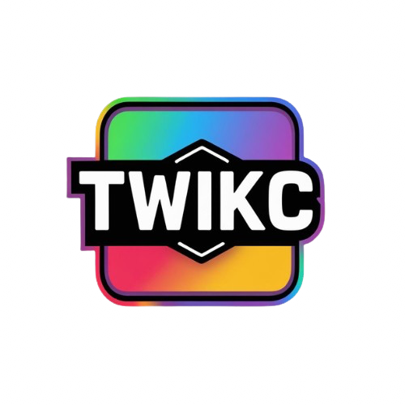

A lightweight recreation of the 2-player game TwixT, on C

    
    
    
   
    
    
   
  <h3>A complete documentation of all the files and functions can be found <a href="https://twikc.netlify.app">here</a></h3>

## Introduction to TwixT
TwixT is a 2-player game in which players have to place their pegs on a 24x24 grid. Two pegs of the same color link together if they form an "L" formation between them. The goal of the players is to make a connect line from one side of the board to the other side.

## Introduction to TwikC
TwikC is a lightweight recreation of the 2-player game TwixT, made entirely on C. The interface is implemented completely on CLI.

## Usage
1) Clone the repository
2) Open the repository directory you just cloned
3) Change your directory to "build"
4) Run `make`
5) Run `./twikc` to run the program

## Dependencies
- **locale.h (Pre-installed)**
- **holi.h (Contained in the repository):** The header file "holi.h" contains macro definitions for ANSI escape sequences for terminal colors

## Contributors
- **Sanyam-Asthana**
